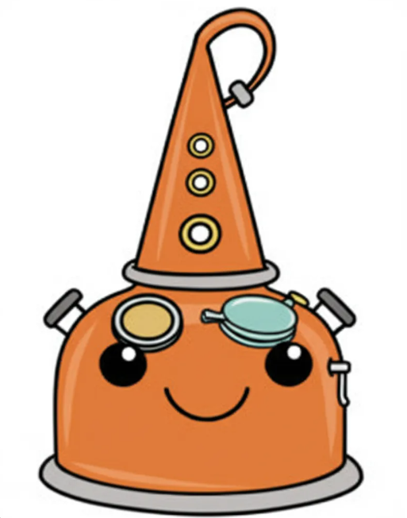

# BabyLM Challenge Project Proposal
<div align="center">
  
  <!-- Generated by: https://www.florafauna.ai/projects/504366 -->
</div>

## Final Experiments & Code Submission
Deliverables (Due April 18, 2025):
Final version of code in main branch on GitHub. Code should be clean, runnable, and ready for grading. ✅

Best trained model: [Google Drive: PalenkaLlama1-58M-strict-L0.1-H0.5](https://drive.google.com/file/d/1_CSX3n7_nMJFDg5nSx54adjB_pNU6_2k/view?usp=sharing)

### Running code

SLURM Job Scripts:
- `train_baselines.slurm`: Train baseline models (GPT2, DistilledGPT, BabyLlama)

- `train_gridsearch_finalist.slurm`: 
Train final DSKD models with hyperparameters found by basic grid search

- `eval-blimp_baselines.slurm`: Evaluate models on BLiMP benchmark

- `eval-all_baselines.slurm`: Full evaluation on BLiMP and EWOK

- `scripts/grid.slurm`: Distillation parameter grid search


Shell Scripts:
- `eval-blimp.sh`: Run BLiMP evaluation for a single model
  - Takes model path as argument
  - Tests grammatical knowledge with BLiMP tasks

- `eval-all.sh`: Run full evaluation suite for a single model
  - Takes model path as argument
  - Evaluates on BLiMP + EWOK tasks

- `eval-ewok.sh`: Run EWOK evaluation for a single model
  - Takes model path as argument
  - Tests world knowledge with EWOK filtered tasks

- `distill-BabyLlama1-58M-strict.sh`: Train BabyLlama-1 student model
  - Distills from GPT2-705M and Llama-360M teachers

- `distill-DistilledGPT-44M-strict.sh`: Train DistilledGPT student model  
  - Distills from GPT2-44M and Llama-60M teachers

- `dkds_noaux-PalenkaLlama1-58M-strict.sh`: Train PalenkaLlama student model
  - Distills from GPT2-705M and Llama-360M using DSKD
  - Uses feature mapping between teacher-student layers

#### How to run
Clone the repo and run slurm scripts.
Don't forget to update the trained model paths because of timestamps in the names.
```
# You have to cd to the scripts directory (relative paths are used)
cd scripts
sbatch train_baselines.slurm
```
When running on your own you have to update paths in ./config *.yaml files to your 
folder with train and test data. 
Train your tokenizer in ./cleaning_and_tokenization.ipynb.
Install requirements
```
pip install -r requirements.txt
```

For evaluation 
https://github.com/babylm/evaluation-pipeline-2024?tab=readme-ov-file#install
```
git clone https://github.com/babylm/evaluation-pipeline-2024
cd evaluation-pipeline-2024
pip install -e .
pip install minicons
pip install --upgrade accelerate
```

### Summary of experiments
We recreated and trained following baselines:
Basic
  - `GPT2-44M`
  - `GPT2-705M`
  - `GPT2-small-97M`
  - `Llama-60M`
  - `Llama-360M`

Distilled
- `DistilledGPT-44M`
  - Teachers: GPT2-44M, Llama-60M
  - Student: GPT2-44M
  - Loss functions: 50% hard target loss + 50% logit loss 
- `BabyLlama-1-58M` 
  - Teachers: GPT2-705M, Llama-360M 
  - Student: Llama-60M
  - Loss functions: 50% hard target loss + 50% logit loss

We created 
 - `PalenkaLlama1-58M`
    - Teachers: GPT2-705M, Llama-360M 
    - Student: Llama-60M
    - Loss functions:  100% hard target loss + 10% logit loss + 50% hidden state loss

#### Methods
We experimented with following distillation methods:

Deeply Supervised Knowledge Distillation (DSKD)
Contrastive distillation and distillation with auxiliary classifiers
* Base paper: [Contrastive Distillation Is a Sample-Efficient Self-Supervised Loss Policy for Transfer Learning](https://arxiv.org/abs/2212.11353) 
* File: distillation_type_experiments/contrastive-distillation.py
* Person: Leah

DSKD without Auxiliary classifiers with a feature mapping using dictionary.
* Base paper: [Knowledge Distillation with Deep Supervision](https://arxiv.org/pdf/2202.07846)
* File: dkds_noaux.py
* Person: Kasym

Hand crafted hidden state distillation 
* File: distillation_type_experiments/hidden-state-distillation.py
* Person: Jan


#### Final Experiments
Based on our preliminary experiments we decided to do finial experimentation only with DSKD without Auxiliary classifiers with a feature mapping using dictionary. The reasons were time constrains and promising evaluation loss.

We used rough gridsearch to optimize weights in the distillation loss function on sample of the test dataset. We trained total of 25 models.

Finally we trained best 3 configurations on the train dataset and evaluated them. 

### Final Results
|    | model_name                                         | blimp_supplement   | blimp_filtered   | ewok_filtered   |
|---:|:---------------------------------------------------|:-------------------|:-----------------|:----------------|
|  0 | BabyLlama1-58M-strict                              | 0.581 ± 0.0054     | 0.676 ± 0.0016   | 0.501 ± 0.0057  |
|  1 | DistilledGPT-44M-strict                            | 0.588 ± 0.0053     | 0.658 ± 0.0016   | 0.500 ± 0.0057  |
|  2 | GPT2-44M-strict                                    | 0.591 ± 0.0056     | 0.633 ± 0.0017   | 0.501 ± 0.0057  |
|  3 | GPT2-705M-strict                                   | 0.574 ± 0.0058     | 0.657 ± 0.0017   | 0.501 ± 0.0057  |
|  4 | GPT2-small-97M-strict                              | 0.563 ± 0.0058     | 0.662 ± 0.0017  |**0.506 ± 0.0057**|
|  5 | Llama-360M-strict                                | **0.610 ± 0.0055**   | 0.654 ± 0.0017   | 0.499 ± 0.0057  |
|  6 | Llama-60M-strict                                   | 0.567 ± 0.0057     | 0.637 ± 0.0017   | 0.499 ± 0.0057  |
|  7 | PalenkaLlama1-58M-strict-L0.1-H0.1 | 0.596 ± 0.0054     | 0.694 ± 0.0016   | 0.500 ± 0.0057  |
|  8 | PalenkaLlama1-58M-strict-L0.1-H0.3 | 0.599 ± 0.0053     | 0.693 ± 0.0016   | 0.499 ± 0.0057  |
|  9 | PalenkaLlama1-58M-strict-L0.1-H0.5 | 0.606 ± 0.0050    |**0.694 ± 0.0016** | 0.503 ± 0.0057  |


## Milestone 4
Goal: Ensure meaningful experimentation is happening. ✅

Deliverables (Due April 14, 2025):  
Implemented modifications in a branch of git repository, including documentation on how to run experiments. ✅

### Distillation methods
#### Contrastive distillation:

* [https://arxiv.org/abs/2212.11353](https://arxiv.org/abs/2212.11353)  
* Code in: main branch \- contrastive-distillation.py  
* Total Loss \= L\_lm \+ α \* L\_logits \+ β \* L\_contrastive  

Where:  
* L\_lm: Standard language modeling loss (cross-entropy)  
* L\_logits: KL-Divergence between student and teacher logits  
* L\_logits \= KL(softmax(student\_logits/T) || softmax(teacher\_logits/T)) \* T²  
* L\_contrastive: Contrastive loss between hidden states
* L\_contrastive \= \-log(exp(sim(h\_s, h\_t)/τ) / Σ exp(sim(h\_s, h\_t')/τ))

  where sim() is cosine similarity and τ is temperature

Parameters:  
  * α \= 0.5 (weight for logit distillation)  
  * β \= 0.1 (weight for contrastive loss)  
  * T \= 2.0 (temperature for logit distillation)  
  * τ \= 2.0 (temperature for contrastive loss)

#### DSKD distillation with auxiliary classifiers:

* Code in: main branch \- dskd-distillation-1-teacher.py and dskd-distillation-ensemble.py  
* Key components:  
  * Auxiliary classifiers for shallow layers to provide intermediate supervision  
  * Adaptive weighting strategy for auxiliary classifiers  
  * Feature map loss and class prediction loss  
  * Projection layers for feature alignment  
* Total Loss \= L\_lm \+ α \* L\_class \+ β \* L\_feature \+ γ \* Σ w\_i \* L\_aux\_i  

Where:  
  * L\_lm: Standard language modeling loss (cross-entropy)  
  * L\_class: Class prediction loss (KL-Divergence)  
  * L\_class \= KL(softmax(student\_logits/T) || softmax(teacher\_logits/T)) \* T²  
  * L\_feature: Feature map loss (MSE)  
  * L\_feature \= MSE(projected\_student\_features, projected\_teacher\_features)  
  * L\_aux\_i: Loss from i-th auxiliary classifier  
  * w\_i: Adaptive weights for auxiliary classifiers  

Parameters:  
  * α \= 0.5 (weight for class prediction loss)  
  * β \= 0.5 (weight for feature map loss)  
  * γ \= 0.1 (weight for auxiliary losses)  
  * T \= 2.0 (temperature)


#### DSKD (Deeply Supervised Knowledge Distillation) without Auxiliary classifiers with a feature mapping using dictionary.

* [https://arxiv.org/pdf/2202.07846](https://arxiv.org/pdf/2202.07846)  
* You can find the code in dkds-noaux.py.  
* Loss function: CE(student) \+ **α \*** loss\_logits(teachers’ last layers,student’s last layer) \+ β \* hidden\_loss(teachers’ hidden layers projected to student’s hidden layer)   
* Loss logits use KL-Divergence and Hidden loss uses MSE.  
* Since the number of layers are different between teachers and the student, feature projections are used. To solve dimensionality problems use projections (nn.Linear). 

### Results

| Model | BLIMP\_filtered | BLIMP\_supplemental |
| :---- | :---- | :---- |
| Baseline | 0.6673 ± 0.0016 | 0.5803 ± 0.0053 |
| DSKD-a5-b3 | **0.6851 ± 0.0016** | **0.5842 ± 0.0053** |
| DSKD-a5-b4 | 0.6721 ± 0.0016 | 0.5807 ± 0.0053 |
| DSKD-a5-b5 | 0.6784 ± 0.0016 | 0.5759 ± 0.0054 |
| DSKD-a4-b4 | 0.6747 ± 0.0016 | 0.5735 ± 0.0055 |
| Contrastive-KD | 0.6759 ± 0.0016 | 0.5707 ± 0.0053 |
| DSKD-teacher-Llama | 0.6468 ± 0.0017 | 0.5421 ± 0.0060 |
| DSKD-ensemble | 0.6536 ± 0.0017 | 0.5544 ± 0.0058 |

Table 1\. Baseline is a student BabyLlama-58M with teachers of Llama-16M and GPT2-97M. DKDS has no auxiliary classifiers, uses the same model architectures with the approach described above, where a represents alpha (e.g. 5 means 0.5) and b represents beta in the loss function. DSKD-teacher-Llama distills the knowledge from one teacher, Llama-16M using auxiliary classifiers. DSKD-ensemble is an ensemble from two teachers using auxiliary classifiers. Results in bold show the best performance.

* As a result, Deeply Supervised Knowledge distillation outperforms the baseline model which uses vanilla Knowledge distillation on the same architecture.


### How to run experiments  
To train teachers, run sbatch train.slurm which uses train.py. Choose config files of the teachers that you want to teach your student.   
To run Deeply-Supervised Knowledge Distillation without auxiliary classifiers, run sbatch distill.slurm which uses dkds-noaux.py. Change hyperparameters as needed in dkds-noaux.py. 

### Baseline training
Our ad-hoc baseline: BabyLlama 58M distilled from GPT-2 97M and Llama 16M with loss function consisting of 50% hard target loss and 50% logit loss.

We are training baselines specified in Milestone 2\# right now.   


## Milestone 3

Kasym Manatayev, Leah Le, Jan Stipl

Goal: Ensure working code and evaluation pipeline before modifying the mode ✅

Working implementation of the baseline model in the main branch of the git repository,
 including documentation on how to run experiments. ✅

### How to run the experiments
* Run train.py.slurm for training the teacher
* Run distill.slurm for distill the teachers into BabyLM
* Run slurm-eval.slurm to run evaluation


### How the baseline works

Teacher: Llama-16M and GPT2-97M  
Student: BabyLlama-58M

The distillation uses cross entropy for expected output and Kullback-Leibler divergence for the teacher logits. We used 50% weight for the hard targets (expected output) and 25% for each teacher. 

### Initial results

Evaluation results can be seen in the slurm-207594.out file.  
The whole model had a score of 0.5803 ± 0.0053 in the blimp\_supplement benchmark.  
For the blimp\_filtered a score was 0.6673 ± 0.0016. 

### Any implementation challenges

* Making the paths work on spyder.  
* Running the evaluation pipeline with our own model (we removed a few lines from the original eval.sh script).  
* We couldn’t push the models to git due to their large size.  
* Debugging


## Milestone 2

**Github:** [https://github.com/leahphw/babylm](https://github.com/leahphw/babylm)

### Group Members
Leah Le, Jan Stipl, Kasym Manatayev

## Introduction

Our work is focused on knowledge distillation from a teacher model to a student model. Previous works have shown that this approach leads to better results on a variety of tasks, especially with limited data.

The approach is called distillation, because of its analogy in distilling liquids to extract pure components. In machine learning it is a process of extracting learnt knowledge from teacher model(s) to a student model. Student model can have significantly less parameters than the teacher model and still achieve comparable results as the teacher.

Core idea of distillation is to train student model on "soft targets". "Hard targets" in the form of true labels can be used together with soft target if available. This combination leads to even better results. In basic approach soft targets are created by increasing temperature in the SoftMax function used on the output layer of teacher model. The temperature $T$ controls how soft is the resulting probability distribution. 
Softer distribution is favorable for training the student because:
1) If the probabilities are close to 0, they have very little influence on the cross entropy training loss.
2) Information about how similar are the target classes to each other can be better learned by the student. This information is valuable for generalization of the model.
The equation for the softmax function with temperature is
$$q_i = \frac{\exp(z_i/T)}{\sum_j \exp(z_j/T)}$$
Where:
- $q_i$ is the probability for class $i$
- $z_i$ is the logit (pre-softmax activation) for class $i$
- $T$ is the temperature parameter, higher $T$ causes softer probability distribution over clasess
- The sum in the denominator is over all classes $j$. 

- [Distilling the Knowledge in a Neural Network](https://arxiv.org/pdf/1503.02531)
- [Knowledge Distillation: A Survey](https://link.springer.com/content/pdf/10.1007/s11263-021-01453-z.pdf)

## Baseline

We have selected our baseline models to follow DistilledGPT base paper and BabyLM 3rd round base models.

Below are our selected baselines:
- **Baseline 1:** GPT-2 Small  
- **Baseline 2:** DistilledGPT  
- **Baseline 3 (optional):** BabyLlama (BabyLM 1) and BabyLlama-2 (BabyLM 2)  

DistilledGPT uses GPT2-44M and Llama-60M as teacher models. The teacher models were trained on the Strict Small dataset, and then the student model is trained using a combination of cross-entropy student loss with true labels, and distillation loss between the student’s output and each teacher’s output.

**Pros:**
- Reduction in training time by around 70% and in parameters by around 25% compared to BabyLlama, while maintaining similar performance.

**Cons:**
- The authors did not provide the weights used to combine loss from true labels and distillation loss nor the distilling temperature. They indicate that they used a similar setup as the BabyLlama paper.

We are not going to use GPT-BERT, the recommended baseline in BabyLM 2025, because it follows a different architecture. Instead, we are going to follow the DistilledGPT paper from BabyLM 3rd edition, try to recreate their findings, and improve on them with a different distillation method.

- **GPT-2 Small:** [Language models are unsupervised multitask learners](https://cdn.openai.com/better-language-models/language_models_are_unsupervised_multitask_learners.pdf)
- **DistilledGPT-44M:** [Teaching Tiny Minds: Exploring Methods to Enhance Knowledge Distillation for Small Language Models](https://aclanthology.org/2024.conll-babylm.27/)
- **GPT-BERT:** [GPT or BERT: why not both?](https://arxiv.org/pdf/2410.24159)
- **BabyLlama-2:** [BabyLlama-2: Ensemble-Distilled Models Consistently Outperform Teachers With Limited Data](https://aclanthology.org/2024.conll-babylm.26/)
- **BabyLlama:** [Baby Llama: Knowledge Distillation from an Ensemble of Teachers Trained on a Small Dataset with No Performance Penalty](https://aclanthology.org/2023.conll-babylm.24/) ([Github](https://github.com/))

## Experimental System

Our approach differs from the baseline in that, instead of only distilling knowledge from the final layer, we implement **Deeply-Supervised Knowledge Distillation (DSKD)**. This method allows the student model to learn from both the class predictions and intermediate feature maps of the teacher.

- [Deeply-Supervised Knowledge Distillation (DSKD)](https://arxiv.org/pdf/2202.07846)
- Similar to traditional knowledge distillation, the student learns from the teacher’s softmax outputs using KL divergence loss.
- The student is explicitly trained to align its internal feature maps with those of the teacher.
- Feature representations from multiple teacher layers (not just the last one) are selected and matched with corresponding student layers.
- Guides all layers of the student, not just the final layer, leading to more structured feature learning.
- The student benefits from learning hierarchical feature representations, improving robustness in low-data settings like BabyLM.

## Experiments (Scratch Work)

- We will start training on the **Strict-Small dataset** for **10M tokens**. However, our approach is flexible, and depending time and computational resources, we may increase to **100M tokens** (Strict dataset).
- The dataset will be taken from the BabyLM dataset—no custom datasets will be constructed.
- We will not use other evaluation techniques except for the given BabyLM tasks.
- Evaluation Metrics:
  - Cross-entropy loss on the held-out test set.
  - BLiMP scores for the “filtered” and “supplement” subsets of evaluation tasks.
  - Mean SuperGLUE score.

## Expected Challenges and Computational Needs

### Challenges
- Not being able to complete the training in time due to unclear scope and technical issues.
- Finding the correct parameters while replicating experiments.
- No concrete strategy yet for implementing different distillation methods in a transformer architecture.
- Restrictions in **BabyLM 3rd edition**:
  - Distillation is permitted.
  - Interaction track does not allow access to student model output probabilities.
  - Students may be fine-tuned or distilled without restriction.
  - Teachers must come from a **predetermined list** of models available on the BabyLM website.
  - Limited details on Slack and website updates are pending.

### Computational Needs
With our limited experience it is hard to estimate the computational power needed for our experiments. According to cited literature DistilledGPT took 3 hours to train and BabyLlama 58M took 10 hours on a single A5000 GPU. Based on this we estimate that upper limit to complete MVP with limited experimentation would be 48 hours of A5000 equivalent GPU time. 
## Minimum Viable Product (MVP)

### MVP
- Working data loading pipeline.
- Working evaluation pipeline.
- Working and trained baseline models (replicated from baseline papers).
- Working and trained novel model using a distillation method that was not explored in previous BabyLM competitions.

### Nice to Have
- Experiment with additional distillation methods.
- Implement layer-wise distillation techniques from:
  - [Less is More: Task-aware Layer-wise Distillation for Language Model Compression](https://arxiv.org/abs/2210.01351) ([Github](https://github.com/))

### MVP Backup Plan
- Working data loading pipeline.
- Working evaluation pipeline.
- Working and trained baseline models (replicated from baseline papers).
- If new distillation methods are not feasible, shift focus to **model size experiments** suggested in the DistilledGPT paper.

## Generative AI use disclosure
* No text in this proposal comes from AI
* AI was used only for ideas how to introduce distillation in a simple manner for the introduction section
